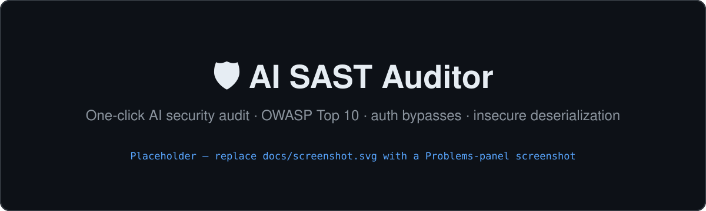

# 🛡️ AI SAST Auditor

A one-click AI security audit, run from a **status-bar button** in VS Code — or
from the CLI and CI. Point it at a codebase and Claude (Opus 4.8) performs a
static application security review focused on the bugs that actually get you
breached: **authentication/authorization bypasses, insecure deserialization,
business-logic flaws, and the full OWASP Top 10** — not style or syntax noise.

Findings land in the **Problems panel** (or as SARIF / Markdown) with a CWE ID,
attack vector, proof-of-concept, verification trace, and a concrete fix on each.

> Built for auditing code **you own or are authorized to test**.



> _Placeholder banner — replace `docs/screenshot.svg` with a real screenshot of the Problems panel showing findings (a PNG works too; just update this path)._

---

## What makes it different from a generic "AI code review"

- **Scout → verify loop.** It doesn't just pattern-match. It maps entry points,
  follows untrusted input across files, and then *verifies* each candidate —
  tracing routing, middleware, and DB policies to rule out false positives before
  reporting. Every finding carries the trace it used to confirm exploitability.
- **Reports one finding at a time** through a strict schema tool, so results are
  always well-formed (no truncated or hallucinated report blobs).
- **Secret-safe.** It redacts `.env` values and hardcoded key literals *before*
  they reach the model, so it can flag "committed secrets" without ever
  exfiltrating them. A security tool shouldn't be a data-exfiltration risk.
- **Framework-aware.** It fingerprints the stack first (Next.js/Supabase, Django,
  Rails, Spring, …) and hunts for that stack's specific footguns.

## Example findings

Run against a real Next.js + Supabase app, it surfaced (among others):

| Severity | Finding | CWE |
|---|---|---|
| CRITICAL | Committed `service_role` key + API keys in `.env.local` | CWE-798 |
| CRITICAL | RLS policy `USING (share_token IS NOT NULL)` is always-true → every user's data readable with the public anon key | CWE-284 |
| MEDIUM | Unauthenticated SSRF via unanchored URL regex → `fetch(rawUrl)` | CWE-918 |
| MEDIUM | Unauthenticated LLM endpoints (unbounded cost/DoS) | CWE-770 |

---

## Install (VS Code button)

```bash
git clone <your-repo-url> && cd ai-sast-auditor
python3 -m venv .venv && ./.venv/bin/pip install -r requirements.txt

# Package and install the extension
npx @vscode/vsce package --no-dependencies --allow-star-activation
code --install-extension ai-sast-auditor-0.0.1.vsix
```

Then in VS Code:
1. Set `sast.pythonPath` (Settings → search "sast") to your venv's Python, e.g.
   `/path/to/ai-sast-auditor/.venv/bin/python`.
2. Export your key in the shell you launch VS Code from: `export ANTHROPIC_API_KEY=sk-ant-...` then `code .`
3. Reload the window — the **🛡️ SAST Audit** button appears in the status bar.
   Open a project, click it, and watch **Output → AI SAST Auditor**.

## Use the CLI (and CI)

```bash
export ANTHROPIC_API_KEY=sk-ant-...

python sast_auditor.py /path/to/project                       # human-readable report
python sast_auditor.py /path/to/project --json                 # JSON on stdout only
python sast_auditor.py /path/to/project --sarif out.sarif --md out.md
```

`--sarif` emits SARIF 2.1.0 — the standard format GitHub code scanning ingests.
See [`.github/workflows/sast.yml`](.github/workflows/sast.yml) for a ready-to-use
GitHub Action that runs the audit and uploads findings to your repo's Security
tab. Add your key as the `ANTHROPIC_API_KEY` repo secret first.

---

## How it works

```
list_files / search_code / read_file   ← Claude explores (sandboxed to the repo)
          │   (secret files redacted en route)
          ▼
   scout → verify each candidate
          │
          ▼
   report_finding  (one strict-schema call per finding)
          ▼
   finish_audit → summary + cost  →  Problems panel / SARIF / Markdown / JSON
```

The whole repo is never bulk-uploaded — only the snippets Claude chooses to read
are sent, and secret-bearing files are redacted first.

## Configuration

| Where | Setting | Default | Notes |
|---|---|---|---|
| `sast_auditor.py` | `MODEL` | `claude-opus-4-8` | Swap to `claude-sonnet-4-6` for ~40% cheaper, slightly less thorough runs. |
| `sast_auditor.py` | `EFFORT` | `medium` | `low` \| `medium` \| `high` \| `max`. Higher = more thorough, more tokens. |
| VS Code | `sast.pythonPath` | `python3` | Point at the venv with `anthropic` installed. |

Each run prints an **estimated cost** (prompt caching keeps repeat context at
~0.1× price). Expect a few cents to ~$1 depending on repo size and effort.

## Limitations

- It's an assistant, not a guarantee — treat findings as leads to verify, and
  absence of findings as "nothing obvious found," not "secure."
- Static analysis only; it reads code, it doesn't run or fuzz the app.
- Costs real API tokens per run.

## License

MIT — see [LICENSE](LICENSE).
